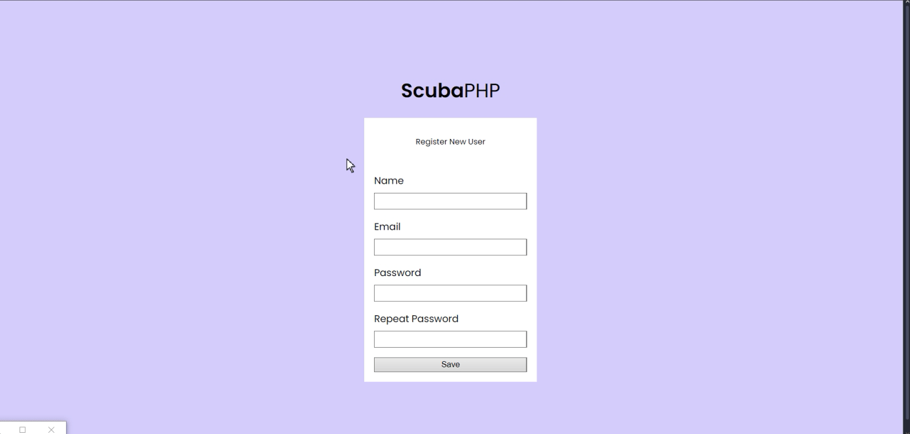
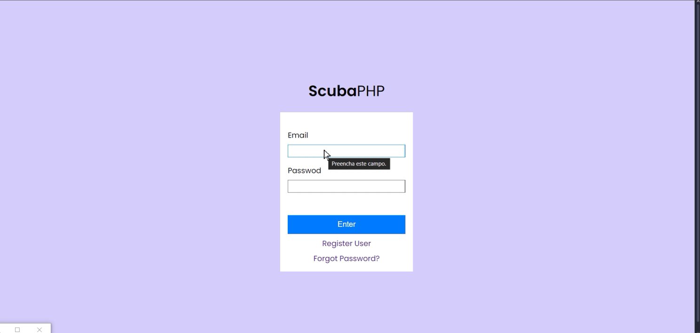

# SCUBA-PHP

| :placard: Vitrine.Dev |     |
| -------------  | --- |
| :sparkles: Name        | **SCUBA-PHP**
| :label: Build With | php, composer
| :rocket: URL         | 
| :fire: Challenge     | https://7daysofcode.io/matricula/php




## About The Project


* 7 Days Of Code Challenge
  * The challenge proposes implementing a complete CRUD and email login and validation system for a framework. 
  
* The main focus of this project was to practice how to:
  * Implement login, register, email validation and password recovery 
  * Improve old code implementation
  
- Schedule
  - Day 1: Create view and controller and redo router script;
  - Day 2: Implement create user;
  - Day 3: Register form validation;
  - Day 4: Set php mailer and encrypt functions to confirm email;
  - Day 5: Set authentication with session and handle auth routes. Validate confirm token;
  - Day 6: Change home page dynamically, allow delete data and logout
  - Day 7: Set change and forget password;
  
- Observations:
 - To run the application execute the command : 
 ```
 php -S localhost:4242
 ```